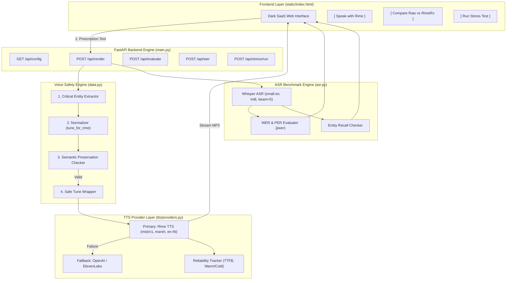

# RimeRx System Architecture & Pipeline

> **End-to-End Voice Safety Pipeline for Indian Medication Instructions**

## Pipeline Component Description

1. **Frontend Layer (`static/index.html`)**: Dark-themed interactive interface providing real-time audio playback, side-by-side Before/After audio evaluation, active Rime configuration display, and stress test batch runner.
2. **FastAPI Backend (`main.py`)**: REST endpoints serving speech synthesis, audio streaming, evaluation metrics, and benchmark management.
3. **Voice Safety Engine (`data.py`)**: Deterministic regex-based entity extractor and `tune_for_rime` speech normalizer. Enforces `validate_semantic_preservation()` to guarantee zero unauthorized number/drug modifications.
4. **TTS Provider Layer (`tts/providers.py`)**: Manages Rime TTS (`mist/v1`, `marsh`, `en-IN`, `mp3`). Implements `synthesize_with_fallback()` with transparent logging (`Rime unavailable — fallback provider active.`) when fallbacks are enabled.
5. **ASR Benchmark Engine (`asr.py`)**: Closed-loop verification using `faster-whisper` (`small.en`) to transcribe synthesized audio and compute Critical Token Accuracy, WER, and PER.
